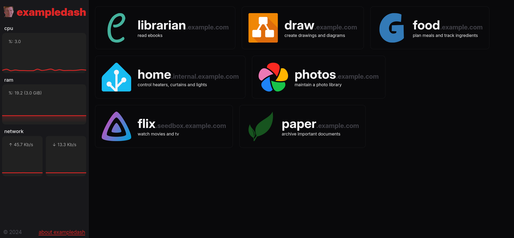
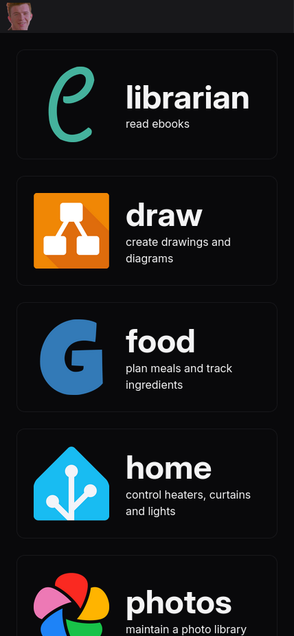
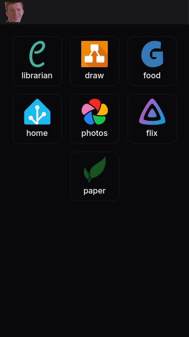

# 
blobdash

### yet another simple self-hosted dashboard

  

## Installation

Designed to be used with Docker and docker-compose. An example `compose.yaml` file can be found at [`docs/examples/compose.example.yaml`](docs/examples/compose.example.yaml).

## Configuration

Blobdash uses [TOML](https://toml.io/) for configuration. It checks for a file named `blobdash.toml`
both in its working directory (in the Docker image, this is at `/app/blobdash.toml`) and in the root
directory (`/blobdash.toml`). If both are present, values in `/blobdash.toml` will override those
set in `/app/blobdash.toml`.

An example configuration file is present in this repository at
[`docs/examples/blobdash.example.toml`](docs/examples/blobdash.example.toml). Documentation on the
configuration file is present at [`docs/configuration.md`](docs/configuration.md).
